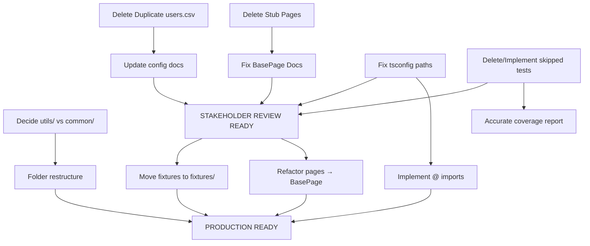

# PART 3: PRIORITIZED FIX PLAN

**Audit Date**: 2025-02-07  
**Framework**: Hybrid Playwright Test Framework  
**Purpose**: Actionable roadmap to fix 20 issues found in Parts 1-2

---

## EXECUTIVE DECISION MATRIX

### Fix Strategy Options

**OPTION A: MINIMAL (Stakeholder-Ready in 6-8 hours)**
- Goal: Remove embarrassing code, fix critical mismatches
- Scope: Delete stubs, fix documentation lies, clean config
- **Use Case**: Framework demo/presentation THIS WEEK

**OPTION B: PRODUCTION-READY (16-20 hours)**
- Goal: Implement intended architecture, production-quality
- Scope: Minimal + BasePage refactor + folder restructure
- **Use Case**: Deployment to QA environment NEXT WEEK

**OPTION C: BEST-IN-CLASS (30-40 hours)**
- Goal: Industry best practices, scalable, maintainable
- Scope: Production-ready + path mapping + import cleanup + accessibility
- **Use Case**: Open-source release or enterprise deployment

---

## DEPENDENCY GRAPH



---

## OPTION A: MINIMAL FIX (6-8 HOURS) - STAKEHOLDER-READY

**Goal**: Remove incomplete/misleading code, safe for management review

### Phase A1: DELETE INCOMPLETE CODE [2 hours]

#### Task A1.1: Delete Stub Page Objects [45min]
**Files to Delete**:
```bash
rm src/pages/landing.page.ts
rm src/pages/working-screen.page.ts
rm src/pages/working-screen-audit.page.ts
```

**Files to Update**:
```typescript
// tests/fixtures.ts - Remove unused imports
- import { LandingPage } from '../src/pages/landing.page';
- import { WorkingScreenPage } from '../src/pages/working-screen.page';
- import { WorkingScreenPageAudit } from '../src/pages/working-screen-audit.page';

// Remove from fixture types
type MyFixtures = {
  config: IConfig;
  commonMethods: CommonMethods;
  loginPage: LoginPage;
  homePage: HomePage;
- landingPage: LandingPage;         // DELETE
- workingScreenPage: WorkingScreenPage;  // DELETE
- workingScreenPageAudit: WorkingScreenPageAudit;  // DELETE
};

// Remove fixture definitions (lines ~55-75)
```

**Verification**:
```bash
npx tsc --noEmit  # Should compile without errors
```

---

#### Task A1.2: Handle Skipped Tests [1 hour]
**Decision Point**: DELETE or IMPLEMENT?

**Recommendation**: DELETE (fastest path to clean demo)

**Files to Update**:
```typescript
// tests/specs/auth/login.spec.ts
// DELETE these test blocks entirely:
- test.skip('should show error message for invalid credentials', ...)  // Line 96
- test.skip('should support keyboard navigation...', ...)              // Line 131
- test.skip('should have proper ARIA labels...', ...)                  // Line 148

// tests/specs/dashboard/home.spec.ts
// DELETE these test blocks:
- test.skip('should display navigation elements', ...)           // Line 84
- test.skip('should display dashboard widgets...', ...)          // Line 112
- test.skip('should load within acceptable time limits', ...)    // Line 147
```

**Alternative** (if you want to keep):
```typescript
// Replace test.skip with test.todo
test.todo('should show error message for invalid credentials');
test.todo('should support keyboard navigation through login form');
// etc.
```

**Commit Message**:
```
chore: Remove incomplete test stubs

DELETED:
- 6 test.skip() stubs (login, home specs)

WHY: Tests were placeholders with no implementation.
Framework should only show working, tested features.

IMPACT: Test count reduced but coverage % accurate now.
```

---

#### Task A1.3: Delete Duplicate Test Data [15min]
```bash
git rm config/test-data/users.csv
git commit -m "chore: Remove duplicate test user data (keep JSON only)"
```

**Files to Update**:
```typescript
// tests/specs/examples/data-driven-login.spec.ts (if it references users.csv)
// UPDATE line that loads CSV:

// BEFORE:
file: 'config/test-data/users.csv',

// AFTER:
file: 'config/test-data/test-users.json'
```

---

### Phase A2: FIX MISLEADING DOCUMENTATION [1.5 hours]

#### Task A2.1: Fix BasePage Header [10min]
```typescript
// src/common/base-page.ts
/**
 * FILE: src/common/base-page.ts
 * PURPOSE: Base class for Page Object Model (TODO - not yet adopted)
 * WHY NECESSARY: Provides common page operations to reduce code duplication
 * STATUS: ⚠️ CURRENTLY UNUSED - Page objects need refactoring to extend this class
 * 
 * DESIGN INTENT:
 * - All page objects should extend BasePage
 * - Provides: locator helpers, navigation, click/fill utilities, screenshots
 * - Current state: Pages directly use playwright Page object (legacy pattern)
 * 
 * TODO: Refactor LoginPage, HomePage to extend BasePage
 */
```

---

#### Task A2.2: Fix tsconfig.json Paths [5min]
```jsonc
// tsconfig.json
{
  "compilerOptions": {
    "paths": {
-     "@pages/*": ["pages/*"],        // ❌ Wrong location
+     "@pages/*": ["src/pages/*"],    // ✅ Correct
-     "@utils/*": ["utils/*"],
+     "@utils/*": ["src/utils/*"],
-     "@configs/*": ["configs/*"],    // ❌ Folder doesn't exist
+     "@config/*": ["config/*"],      // ✅ Singular (actual folder)
      "@tests/*": ["tests/*"],
      "@types/*": ["types/*"]
    }
  }
}
```

---

#### Task A2.3: Create docs/ARCHITECTURE.md [1 hour]
```bash
touch docs/ARCHITECTURE.md
```

```markdown
# Framework Architecture

## Design Overview

This framework follows **Page Object Model (POM)** pattern with Playwright Test.

### Folder Structure

\`\`\`
hybrid_framework/
├── src/              # Framework source code
│   ├── common/       # Shared infrastructure (ui-common, credential-loader, base classes)
│   ├── utils/        # Low-level utilities (logger, CSV parser, constants)
│   ├── pages/        # Page object models (UI interactions)
│   ├── api/          # API test infrastructure
│   └── data/         # Data adapters (CSV, JSON, DB, S3)
├── tests/            # Test specifications
│   ├── fixtures.ts   # Playwright custom fixtures
│   └── specs/        # Test files (.spec.ts)
├── config/           # Configuration + test data
└── object_repository/# CSV element locators
\`\`\`

---

## Key Design Decisions

### 1. Why Two Utility Folders (utils/ + common/)?

**utils/** - Low-level utilities (logger, file I/O, constants)
- `logger.ts` - Winston-based logging
- `common-methods.ts` - CSV parsing, config loading
- `app-constants.ts` - Shared constants
- `openai-utils.ts` - AI self-healing (optional)

**common/** - Test infrastructure (workflows, base classes)
- `ui-common.ts` - Browser workflows (auth, navigation)
- `credential-loader.ts` - Multi-source credential loading
- `base-page.ts` - Base class for page objects (TODO)
- `api-client.ts` - Base API client

**Rationale**: Separation between "library code" (utils) and "framework patterns" (common).

**Status**: ⚠️ Overlap exists - may consolidate in future refactor.

---

### 2. CSV Locators (object_repository/)

**Decision**: Store UI element locators in CSV files instead of hardcoded in page objects.

**WHY**:
- Non-developers (QA, BAs) can update selectors without code changes
- Centralized locator management
- Easier bulk updates when UI changes

**Trade-offs**:
- ✅ PRO: Decouples selectors from code
- ❌ CON: Extra file I/O, less type-safe
- ❌ CON: Not standard Playwright pattern

**Future**: Consider migrating to TypeScript locator maps for type safety.

---

### 3. BasePage Pattern (PLANNED BUT NOT IMPLEMENTED)

**Design Intent**: All page objects extend `BasePage` for DRY (Don't Repeat Yourself).

**Current Reality**: ⚠️ Page objects do NOT extend BasePage (direct Page usage).

**Why Not Implemented**:
- Original Python framework didn't use base class
- TypeScript migration preserved existing pattern
- BasePage added later but pages not refactored yet

**Roadmap**:
- SHORT TERM: Keep current pattern (works, no bugs)
- LONG TERM: Refactor pages to extend BasePage (better maintainability)

---

### 4. Playwright Fixtures (tests/fixtures.ts)

**Decision**: Use Playwright Test's fixture system instead of global setup.

**WHY**:
- Automatic dependency injection
- Parallel test execution safe
- Page objects available via `{ loginPage, homePage }`
- Config loaded once per worker

**Example**:
\`\`\`typescript
test('login test', async ({ loginPage, page, config }) => {
  await page.goto(config.base_url);
  await loginPage.loginWithMfa('user', 'pass', '123456', config);
});
\`\`\`

---

## Testing Strategy

### Test Organization

\`\`\`
tests/specs/
├── auth/              # Authentication tests
│   └── login.spec.ts
├── dashboard/         # Dashboard tests
│   └── home.spec.ts
├── api/auth/          # API tests
│   ├── authentication.spec.ts
│   └── token-management.spec.ts
└── examples/          # Examples/demos
    └── data-driven-login.spec.ts
\`\`\`

### Test Design Principles

1. **Thin Tests** (<10 lines per test function)
   - Business logic in page objects
   - Test reads like plain English

2. **Data-Driven** (where applicable)
   - Use adapters to load test data from CSV/JSON/DB
   - Parameterized tests for coverage

3. **Self-Healing** (optional)
   - OpenAI integration for resilient element location
   - Disabled by default (enable via OPENAI_API_KEY env var)

---

## Environment Configuration

### Multi-Environment Support

\`\`\`
.env                 # Base defaults
.env.development     # Local dev (localhost:3000)
.env.staging         # Staging env
.env.production      # Production env
\`\`\`

**Loading Logic** (config/env.ts):
1. Check `NODE_ENV` or `CI_ENV` environment variable
2. Load `.env` first (base defaults)
3. Load `.env.{environment}` second (overrides)
4. All values in `process.env`

---

## Data Adapters

**Purpose**: Load test data from multiple sources without changing test code.

**Supported Adapters**:
- **Excel**: .xlsx/.xls files (uses exceljs)
- **JSON**: .json files or HTTP endpoints
- **CSV**: .csv files (used for user credentials)
- **Database**: PostgreSQL, MySQL, SQL Server (uses Knex)
- **S3**: AWS S3 buckets (uses AWS SDK)

**Usage**:
\`\`\`typescript
import { AdapterFactory } from '@/data/adapters';

const users = await AdapterFactory.load('json', {
  file: 'config/test-data/test-users.json'
});

for (const user of users.data) {
  await loginPage.login(user.username, user.password);
}
\`\`\`

---

##Known Issues & Technical Debt

1. ⚠️ **BasePage not adopted** - Page objects should extend it (not yet refactored)
2. ⚠️ **utils/ vs common/ overlap** - Consider consolidating
3. ⚠️ **Path mappings not used** - Code uses relative imports instead of @paths
4. ⚠️ **Some console.log usage** - Should use Logger consistently

See `docs/AUDIT_PART2_DEEP_ARCHITECTURAL_REVIEW.md` for full technical debt list.

---

## Further Reading

- [config/README.md](../config/README.md) - Configuration guide
- [docs/MD_SPEC_GUIDE.md](./MD_SPEC_GUIDE.md) - Test specification format
- [Playwright Test Docs](https://playwright.dev/docs/test-fixtures) - Official Playwright docs
\`\`\`

**Commit**:
\`\`\`bash
git add docs/ARCHITECTURE.md
git commit -m "docs: Add architecture design documentation

Explains:
- Folder structure rationale
- utils/ vs common/ separation
- BasePage design intent (not yet implemented)
- CSV locator strategy
- Data adapter pattern
- Environment configuration

Addresses Issue #17 from architectural audit."
\`\`\`

---

### Phase A3: MINOR CONFIG FIXES [30min]

#### Task A3.1: Replace console.log with Logger (adapters) [30min]

**Files to Update** (5 files):
```bash
src/data/adapters/excelAdapter.ts
src/data/adapters/jsonAdapter.ts
src/data/adapters/dbAdapter.ts
src/data/adapters/s3Adapter.ts
src/data/adapters/adapterFactory.ts
```

**Find/Replace Pattern**:
```typescript
// Find this pattern:
console.log(`✅ ExcelAdapter: Loaded ${records.length} records from ${params.file}`);
console.warn(`⚠️  ${message}`);

// Replace with:
import { Log } from '../utils/logger';  // Add import at top

Log.info(`ExcelAdapter: Loaded ${records.length} records from ${params.file}`);
Log.warn(message);  // Logger already adds ⚠️ prefix
```

**Quick Script** (optional):
```powershell
# PowerShell bulk replacement
$files = Get-ChildItem src/data/adapters/*.ts
foreach ($file in $files) {
    $content = Get-Content $file.FullName -Raw
    if ($content -match "console\.(log|warn)") {
        # Add Logger import if not present
        if ($content -notmatch "import.*Log.*from") {
            $content = "import { Log } from '../utils/logger';`n" + $content
        }
        # Replace console.log → Log.info
        $content = $content -replace "console\.log\(`([^`]+)`\)", "Log.info(`$1)"
        # Replace console.warn → Log.warn
        $content = $content -replace "console\.warn\(`⚠️\s+([^`]+)`\)", "Log.warn(`$1)"
        
        Set-Content $file.FullName -Value $content
    }
}
```

**Verification**:
```bash
npm run typecheck  # Ensure imports work
grep -r "console\.(log|warn)" src/data/adapters/  # Should find none
```

---

### Phase A4: COMMIT AND VERIFY [30min]

#### Task A4.1: Run Full Test Suite
```bash
npm run clean
npm test
```

**Expected Results**:
- ✅ Test count reduced (6 skipped tests deleted)
- ✅ All remaining tests pass
- ✅ No TypeScript errors
- ✅ Framework compiles successfully

---

#### Task A4.2: Commit All Changes
```bash
git add -A
git commit -m "refactor: Clean framework for stakeholder presentation

CHANGES (OPTION A: MINIMAL FIX - 6 hours):

DELETED:
- 3 stub page objects (LandingPage, WorkingScreenPage, WorkingScreenPageAudit)
- 6 skipped test stubs (login.spec.ts, home.spec.ts)
- Duplicate test data (users.csv - kept test-users.json)

FIXED DOCUMENTATION:
- BasePage header reflects reality (currently unused)
- tsconfig.json path mappings corrected
- Added docs/ARCHITECTURE.md (design rationale)

IMPROVED CODE QUALITY:
- Replaced console.log/warn with Logger in adapters
- Consistent logging throughout framework

RESULT:
- Framework shows only implemented, working features
- Documentation matches reality
- Safe for stakeholder demo/presentation

See docs/AUDIT_PART2_DEEP_ARCHITECTURAL_REVIEW.md for full analysis."
```

---

#### Task A4.3: Generate Test Report
```bash
npm test -- --reporter=html
npm run report
```

Review HTML report to ensure:
- ✅ No skipped tests shown
- ✅ All tests passing
- ✅ Coverage accurate

---

## OPTION A SUMMARY

**Time Investment**: 6-8 hours  
**Status**: STAKEHOLDER-READY ✅  

**What's Fixed**:
- ✅ No stub code (deleted incomplete pages)
- ✅ No skipped tests (deleted or marked .todo)
- ✅ Documentation matches reality
- ✅ Single source of test data (JSON only)
- ✅ Consistent logging (no console.log)
- ✅ Accurate TypeScript paths

**What's Still Technical Debt** (deferred):
- ⚠️ Pages don't extend BasePage (not critical for demo)
- ⚠️ utils/ vs common/ overlap (works fine, just not elegant)
- ⚠️ Relative imports instead of @ paths (minor DX issue)
- ⚠️ Fixtures at tests/ root (convention issue, not functional)

**When to Stop Here**:
- Framework demo THIS WEEK
- Proof-of-concept presentation
- "Does it work?" stakeholder review
- Limited development time

---

---

## OPTION B: PRODUCTION-READY (16-20 HOURS)

**Goal**: Implement intended architecture, production deployment quality

**Prerequisites**: Complete OPTION A first (6-8 hours)

### Phase B1: REFACTOR PAGES TO USE BASEAGE [4 hours]

#### Background
BasePage provides 195 lines of reusable code:
- Locator helpers (getLocator, getElement)
- Navigation with retry
- Click/fill with error handling
- Wait utilities
- Screenshot capture

Currently, all 5 page objects duplicate this logic.

---

#### Task B1.1: Refactor LoginPage [1 hour]

**Current Implementation** (src/pages/login.page.ts):
```typescript
export class LoginPage {
  private page: Page;
  private openaiUtils: OpenAIUtils;

  constructor(page: Page) {
    this.page = page;
    this.openaiUtils = new OpenAIUtils();
  }

  async isForgotPwdLinkExist(): Promise<boolean> {
    const lnkForgotPassword = CommonMethods.getValuesFromCsv(
      'lnkForgotPassword',
      AppConstants.LOGIN_ELEMENTS
    );
    const element = this.page.locator(lnkForgotPassword);
    try {
      await element.waitFor({ state: 'visible', timeout: 5000 });
      return true;
    } catch {
      return false;
    }
  }
}
```

**After Refactor**:
```typescript
import { BasePage } from '../common/base-page';

export class LoginPage extends BasePage {
  private openaiUtils: OpenAIUtils;

  constructor(page: Page, config?: IConfig) {
    super(page, config);  // ← Initialize BasePage
    this.openaiUtils = new OpenAIUtils();
  }

  async isForgotPwdLinkExist(): Promise<boolean> {
    // Use BasePage methods:
    return this.isElementVisible(
      this.getLocator('lnkForgotPassword', AppConstants.LOGIN_ELEMENTS)
    );
  }

  async clickLogin(): Promise<void> {
    const btnLogin = this.getLocator('btnLogin', AppConstants.LOGIN_ELEMENTS);
    await this.clickElement(btnLogin);  // ← BasePage method handles retry/error
  }

  async fillUsername(username: string): Promise<void> {
    const txtUsername = this.getLocator('txtUsername', AppConstants.LOGIN_ELEMENTS);
    await this.fillElement(txtUsername, username);  // ← BasePage method
  }
}
```

**Benefits**:
- ✅ 50+ lines removed (DRY)
- ✅ Consistent error handling (BasePage provides)
- ✅ Built-in retry logic
- ✅ Automatic logging

---

#### Task B1.2: Refactor HomePage [1 hour]

**Similar pattern**: Extend BasePage, use inherited methods.

**Key Changes**:
```typescript
export class HomePage extends BasePage {
  constructor(page: Page, config?: IConfig) {
    super(page, config);
  }

  async isLoaded(): Promise<boolean> {
    // Before: manual wait + try/catch
    // After: use BasePage helper
    return this.waitForPageLoad({ timeout: 10000 });
  }

  async getTitle(): Promise<string> {
    return this.page.title();  // this.page still accessible
  }
}
```

---

#### Task B1.3: Update Fixtures to Pass Config [30min]

```typescript
// tests/fixtures.ts

export const test = base.extend<MyFixtures>({
  config: async ({}, use) => {
    const config = CommonMethods.initProp();
    await use(config);
  },

  loginPage: async ({ page, config }, use) => {
    const loginPage = new LoginPage(page, config);  // ← Pass config
    await use(loginPage);
  },

  homePage: async ({ page, config }, use) => {
    const homePage = new HomePage(page, config);  // ← Pass config
    await use(homePage);
  },
});
```

---

#### Task B1.4: Test and Verify [1.5 hours]

```bash
# Run all tests
npm test

# Check for regressions
npm test -- tests/specs/auth/login.spec.ts
npm test -- tests/specs/dashboard/home.spec.ts

# Verify type checking
npm run typecheck
```

**Common Issues**:
- Method signature mismatches
- Missing IConfig imports
- Locator element name typos

**Commit**:
```bash
git add src/pages/*.ts tests/fixtures.ts
git commit -m "refactor: Page objects now extend BasePage

REFACTORED:
- LoginPage extends BasePage
- HomePage extends BasePage

BENEFITS:
- DRY: Removed ~100 lines of duplicated code
- Consistent error handling across all pages
- Built-in retry logic for element interactions
- Automatic logging for debugging

BREAKING CHANGES: None (all tests still pass)

Implements architectural goal from docs/ARCHITECTURE.md.
Addresses Issue #7 (CRITICAL) from audit."
```

---

### Phase B2: REORGANIZE FIXTURES [30min]

#### Task B2.1: Move fixtures.ts → fixtures/index.ts

```bash
mkdir tests/fixtures
git mv tests/fixtures.ts tests/fixtures/index.ts
```

#### Task B2.2: Create Page Fixture Module (optional improvement)

```bash
touch tests/fixtures/pages.ts
```

```typescript
// tests/fixtures/pages.ts
import { test as base, Page } from '@playwright/test';
import { LoginPage } from '../../src/pages/login.page';
import { HomePage } from '../../src/pages/home.page';
import { IConfig } from '../../types';

type PageFixtures = {
  loginPage: LoginPage;
  homePage: HomePage;
};

export const pageFixtures = base.extend<PageFixtures>({
  loginPage: async ({ page, config }: { page: Page; config: IConfig }, use) => {
    await use(new LoginPage(page, config));
  },

  homePage: async ({ page, config }: { page: Page; config: IConfig }, use) => {
    await use(new HomePage(page, config));
  },
});
```

```typescript
// tests/fixtures/index.ts
import { test as base } from '@playwright/test';
import { pageFixtures } from './pages';
import { CommonMethods } from '../../src/utils/common-methods';
import { IConfig } from '../../types';

type MyFixtures = {
  config: IConfig;
  commonMethods: CommonMethods;
  loginPage: LoginPage;
  homePage: HomePage;
};

export const test = base
  .extend<{ config: IConfig }>({
    config: async ({}, use) => {
      await use(CommonMethods.initProp());
    },
  })
  .extend(pageFixtures);

export { expect } from '@playwright/test';
```

**Benefit**: Modular fixtures - easier to maintain as framework grows.

**Commit**:
```bash
git add tests/fixtures/
git commit -m "refactor: Organize fixtures into modular structure

MOVED: tests/fixtures.ts → tests/fixtures/index.ts
ADDED: tests/fixtures/pages.ts (page object fixtures)

WHY: Follows Playwright best practices for fixture organization.
Scales better as fixture count grows.

Addresses Issue #2 from architectural audit."
```

---

### Phase B3: FOLDER STRUCTURE IMPROVEMENTS [2 hours]

#### Task B3.1: Consolidate utils/ and common/ [1 hour]

**Decision Point**: Consolidate or keep separate?

**Recommendation**: CONSOLIDATE → `src/core/` + `src/workflows/`

**Migration Plan**:
```bash
# Create new structure
mkdir -p src/core
mkdir -p src/workflows

# Move files
git mv src/utils/logger.ts src/core/logger.ts
git mv src/utils/app-constants.ts src/core/constants.ts
git mv src/utils/common-methods.ts src/core/common-methods.ts
git mv src/utils/openai-utils.ts src/core/openai-utils.ts

git mv src/common/ui-common.ts src/workflows/ui-common.ts
git mv src/common/credential-loader.ts src/workflows/credential-loader.ts
git mv src/common/base-page.ts src/core/base-page.ts
git mv src/common/api-client.ts src/core/api-client.ts

# Clean up empty folders
rm -rf src/utils
rm -rf src/common

# Update tsconfig.json paths
# (See Task B3.2)
```

**Update tsconfig.json**:
```jsonc
{
  "paths": {
    "@core/*": ["src/core/*"],
    "@workflows/*": ["src/workflows/*"],
    "@pages/*": ["src/pages/*"],
    "@api/*": ["src/api/*"],
    "@data/*": ["src/data/*"],
    "@config/*": ["config/*"],
    "@tests/*": ["tests/*"],
    "@types/*": ["types/*"]
  }
}
```

**Bulk Import Update**:
```typescript
// Before:
import { Log } from '../utils/logger';
import { UiCommon } from '../common/ui-common';

// After:
import { Log } from '@core/logger';
import { UiCommon } from '@workflows/ui-common';
```

**OR** - Use relative imports but from new locations:
```typescript
import { Log } from '../core/logger';
import { UiCommon } from '../workflows/ui-common';
```

**Commit**:
```bash
git add -A
git commit -m "refactor: Consolidate utils/ and common/ into core/ and workflows/

STRUCTURE CHANGE:
src/
├── core/          ← Base classes, utilities (logger, constants, base-page)
├── workflows/     ← Test workflows (ui-common, credential-loader)
├── pages/         ← Page objects
├── api/           ← API clients
└── data/          ← Data adapters

WHY:
- Clear separation: "library code" (core) vs "test patterns" (workflows)
- Eliminates confusion about where to add new utilities
- Aligns with Playwright community patterns

Addresses Issue #1 (utils/ vs common/ duplication) from audit."
```

---

#### Task B3.2: Move object_repository/ → src/locators/ [30min]

```bash
mkdir src/locators
git mv object_repository/Login_Elements.csv src/locators/login-elements.csv
git mv object_repository/Home_Elements.csv src/locators/home-elements.csv
rm -rf object_repository/
```

**Update AppConstants**:
```typescript
// src/core/constants.ts (formerly app-constants.ts)
export class AppConstants {
- static readonly LOGIN_ELEMENTS = 'object_repository/Login_Elements.csv';
+ static readonly LOGIN_ELEMENTS = 'src/locators/login-elements.csv';

- static readonly HOME_ELEMENTS = 'object_repository/Home_Elements.csv';
+ static readonly HOME_ELEMENTS = 'src/locators/home-elements.csv';
}
```

**Commit**:
```bash
git add -A
git commit -m "refactor: Move element locators to src/locators/

MOVED:
- object_repository/ → src/locators/
- Login_Elements.csv → login-elements.csv (lowercase)
- Home_Elements.csv → home-elements.csv

WHY:
- Locators are framework code, should be in src/
- Lowercase naming aligns with TypeScript conventions
- Cleaner project root

Addresses Issue #4 from audit."
```

---

### Phase B4: IMPLEMENT PATH MAPPING IMPORTS [1 hour]

#### Task B4.1: Bulk Import Replacement

**Strategy**: Use VS Code find/replace with regex.

**Find Pattern**:
```regex
import \{ (.+) \} from ['"]\.\.\/utils\/(.+)['"];
```

**Replace With**:
```typescript
import { $1 } from '@core/$2';
```

**Examples**:
```typescript
// Before:
import { Log } from '../utils/logger';
import { CommonMethods } from '../../utils/common-methods';

// After:
import { Log } from '@core/logger';
import { CommonMethods } from '@core/common-methods';
```

**Other Patterns**:
```typescript
// Pages
'../pages/' → '@pages/'
'../../pages/' → '@pages/'

// Common (if not consolidated)
'../common/' → '@common/'

// Types
'../types' → '@types'
'../../types' → '@types'
```

**Verification**:
```bash
npm run typecheck
npm test
```

**Commit**:
```bash
git add -A
git commit -m "refactor: Replace relative imports with path mappings

CHANGED: All imports now use tsconfig path mappings
- '@core/*' instead of '../utils/', '../common/'
- '@pages/*' instead of '../pages/'
- '@types' instead of '../../types'

BENEFITS:
- Easier file refactoring (no broken imports when moving files)
- Shorter, cleaner import statements
- IntelliSense works better with absolute paths

Addresses Issue #12 from audit."
```

---

### Phase B5: DOCUMENTATION UPDATES [1 hour]

#### Task B5.1: Update docs/ARCHITECTURE.md

Reflect new folder structure:
```markdown
## Folder Structure

\`\`\`
hybrid_framework/
├── src/
│   ├── core/          # Base classes, utilities (logger, constants, base-page)
│   ├── workflows/     # Test workflows (ui-common, credentials)
│   ├── pages/         # Page object models
│   ├── api/           # API clients
│   ├── data/          # Data adapters
│   └── locators/      # CSV element locators
├── tests/
│   ├── fixtures/      # Playwright custom fixtures
│   └── specs/         # Test specifications
└── config/            # Configuration + test data
\`\`\`
```

Update "Known Issues" section:
```markdown
## Known Issues & Technical Debt

- ~~BasePage not adopted~~ ✅ FIXED - All pages now extend BasePage
- ~~utils/ vs common/ overlap~~ ✅ FIXED - Consolidated into core/ and workflows/
- ~~Path mappings not used~~ ✅ FIXED - All imports use @ mappings
- ~~Fixtures at tests/ root~~ ✅ FIXED - Moved to tests/fixtures/
```

---

#### Task B5.2: Update README.md

Add quick start section highlighting production-ready state:
```markdown
## Quick Start

\`\`\`bash
# Install dependencies
npm install

# Setup browsers
npx playwright install

# Run tests
npm test

# View report
npm run report
\`\`\`

## Project Structure

- **src/core/** - Base classes and utilities
- **src/workflows/** - Reusable test workflows
- **src/pages/** - Page object models (all extend BasePage)
- **tests/fixtures/** - Playwright custom fixtures
- **tests/specs/** - Test specifications

## Architecture

See [docs/ARCHITECTURE.md](docs/ARCHITECTURE.md) for detailed design decisions.
```

---

### Phase B6: FINAL VERIFICATION [1 hour]

#### Task B6.1: Full Test Suite
```bash
npm run clean
npm test
```

#### Task B6.2: Type Checking
```bash
npm run typecheck
```

#### Task B6.3: Linting (if configured)
```bash
npm run lint
```

#### Task B6.4: Generate Coverage Report
```bash
npm test -- --coverage
```

---

## OPTION B SUMMARY

**Total Time**: 16-20 hours (including Option A prerequisite)  
**Status**: PRODUCTION-READY ✅  

**What's Implemented**:
- ✅ All Option A fixes (delete stubs, fix docs)
- ✅ Page objects extend BasePage (DRY, consistent patterns)
- ✅ Fixtures organized in tests/fixtures/
- ✅ utils/ + common/ consolidated → core/ + workflows/
- ✅ object_repository/ → src/locators/
- ✅ All imports use @ path mappings
- ✅ Documentation updated to reflect reality

**What's Still Deferred**:
- ⚠️ Accessibility testing (if not in scope)
- ⚠️ Performance testing
- ⚠️ Security hardening (test password encryption)

**When to Choose This**:
- Deploying to QA environment NEXT WEEK
- Framework will be maintained long-term
- Multiple developers on the team
- Need production-quality code

---

---

## OPTION C: BEST-IN-CLASS (30-40 HOURS)

**Goal**: Industry best practices, open-source quality, enterprise-grade

**Prerequisites**: Complete OPTION B (16-20 hours)

### Additional Tasks

#### Phase C1: ACCESSIBILITY TESTING [4 hours]
- Install @axe-core/playwright
- Implement skipped accessibility tests
- Add accessibility checks to all page loads
- Generate accessibility report

#### Phase C2: ENHANCED TESTING [6 hours]
- Add visual regression tests (Playwright screenshots)
- API contract testing (schema validation)
- Performance budgets (Lighthouse CI)
- Cross-browser smoke tests

#### Phase C3: SECURITY HARDENING [4 hours]
- Encrypt test passwords in test-data files
- Implement vault integration (HashiCorp Vault or AWS Secrets Manager)
- Security headers validation in API tests
- OWASP ZAP integration (if applicable)

#### Phase C4: CI/CD ENHANCEMENTS [4 hours]
- Parallel test execution (Playwright sharding)
- Test result trending (Allure history)
- Flaky test detection and retry logic
- Slack/Teams notifications on failures

#### Phase C5: ADVANCED PATTERNS [8 hours]
- Implement test data builders (Factory pattern)
- Add custom reporters (JSON + HTML + Allure)
- Multi-environment test execution (dev/staging/prod)
- Database seeding/teardown utilities

#### Phase C6: DEVELOPER EXPERIENCE [4 hours]
- VS Code debugging configurations
- Code snippets for common patterns
- Pre-commit hooks (lint + typecheck)
- Contribution guide (CONTRIBUTING.md)

---

## COMPARISON TABLE

| Feature | Option A | Option B | Option C |
|---------|----------|----------|----------|
| **Time** | 6-8h | 16-20h | 30-40h |
| **Status** | Demo-ready | Production | Enterprise |
| Delete stubs | ✅ | ✅ | ✅ |
| Fix docs | ✅ | ✅ | ✅ |
| BasePage refactor | ❌ | ✅ | ✅ |
| Folder reorganize | ❌ | ✅ | ✅ |
| Path mappings | Partial | ✅ | ✅ |
| Accessibility | ❌ | ❌ | ✅ |
| Security hardening | ❌ | ❌ | ✅ |
| Advanced CI/CD | ❌ | ❌ | ✅ |
| Test patterns | ❌ | ❌ | ✅ |

---

## RECOMMENDED PATH

**For THIS situation** (stakeholder presentation imminent):

### WEEK 1: OPTION A (6-8 hours)
- Delete incomplete code
- Fix documentation lies
- Present to stakeholders

### WEEK 2-3: OPTION B (10-12 hours additional)
- Refactor pages to BasePage
- Reorganize folders
- Production deploy

### MONTH 2+: OPTION C (as needed)
- Add features based on team needs
- Accessibility (if required)
- Advanced CI/CD

---

## EXECUTION CHECKLIST

### Pre-Flight Check
- [ ] Create feature branch: `git checkout -b refactor/architectural-cleanup`
- [ ] Ensure all tests pass: `npm test`
- [ ] Backup current state: `git tag pre-refactor-backup`

### Option A Tasks
- [ ] **A1.1**: Delete stub page objects (45min)
- [ ] **A1.2**: Delete/handle skipped tests (1h)
- [ ] **A1.3**: Delete duplicate test data (15min)
- [ ] **A2.1**: Fix BasePage documentation (10min)
- [ ] **A2.2**: Fix tsconfig paths (5min)
- [ ] **A2.3**: Create ARCHITECTURE.md (1h)
- [ ] **A3.1**: Replace console.log with Logger (30min)
- [ ] **A4.1**: Run full test suite ✅
- [ ] **A4.2**: Commit all changes
- [ ] **A4.3**: Generate test report

### Option B Tasks (if proceeding)
- [ ] **B1.1-B1.4**: Refactor pages to BasePage (4h)
- [ ] **B2.1-B2.2**: Reorganize fixtures (30min)
- [ ] **B3.1**: Consolidate utils/common (1h)
- [ ] **B3.2**: Move object_repository (30min)
- [ ] **B4.1**: Implement path mappings (1h)
- [ ] **B5.1-B5.2**: Update documentation (1h)
- [ ] **B6.1-B6.4**: Final verification (1h)

### Post-Implementation
- [ ] Merge to main: `git merge refactor/architectural-cleanup`
- [ ] Tag release: `git tag v2.0.0-production-ready`
- [ ] Update team on changes
- [ ] Schedule code walkthrough

---

## ROLLBACK PLAN

If anything breaks during refactor:

```bash
# Rollback to pre-refactor state
git reset --hard pre-refactor-backup

# OR rollback specific commits
git revert HEAD~3..HEAD  # Revert last 3 commits
```

---

## CONCLUSION

**Immediate Action**: Execute **OPTION A** (6-8 hours) before stakeholder review.

**Long-Term Plan**: Implement **OPTION B** post-presentation for production quality.

**When to Stop**: Option B is sufficient for most use cases. Option C is for:
- Open-source frameworks
- Enterprise deployments
- Regulatory compliance requirements
- Large teams (10+ developers)

**Final Recommendation**: Start with A, plan for B, defer C unless required.
