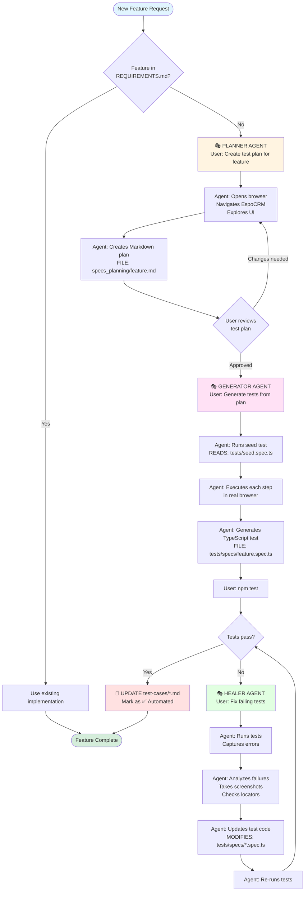
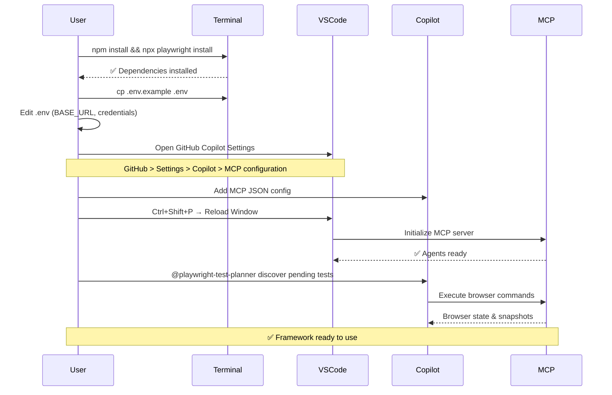
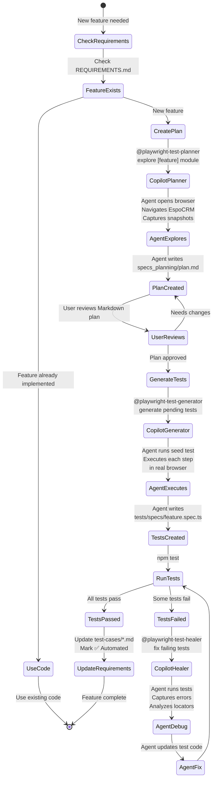
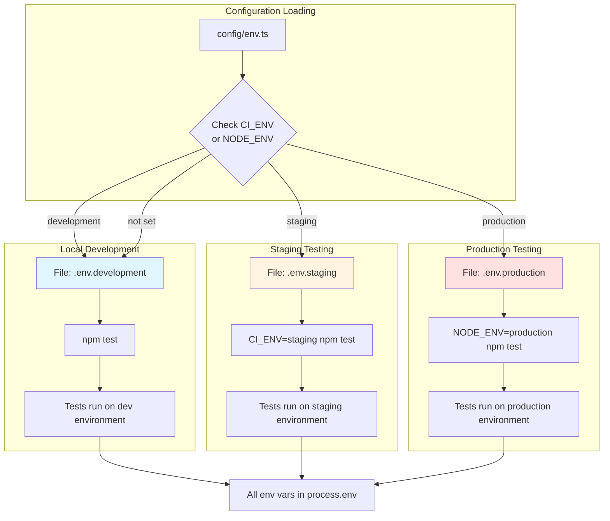
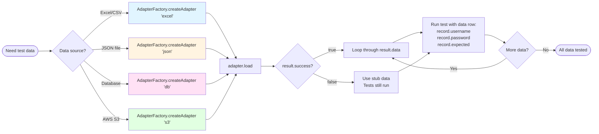
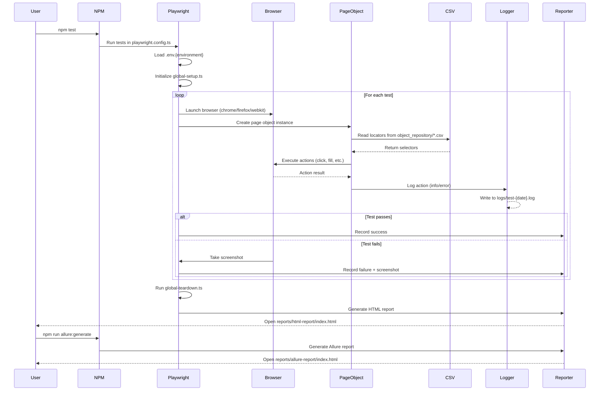

# Framework Workflow - Visual Guide

**Purpose**: Visual flow diagrams showing how to use the Playwright Test Agents framework  
**Audience**: Developers who didn't build the framework  
**Last Updated**: 2026-02-07

---

## 1. Overall Agent Workflow



---

## 2. File CRUD Operations by Agent

```mermaid
graph LR
    subgraph "PLANNER AGENT"
        P1[📖 READ<br/>tests/seed.spec.ts] --> P2[🌐 Browser Interaction<br/>Real-time exploration]
        P2 --> P3[📝 CREATE<br/>specs_planning/feature.md]
    end
    
    subgraph "GENERATOR AGENT"
        G1[📖 READ<br/>specs_planning/feature.md] --> G2[📖 READ<br/>tests/seed.spec.ts]
        G2 --> G3[🌐 Execute Steps<br/>in Browser]
        G3 --> G4[📝 CREATE<br/>tests/specs/feature.spec.ts]
    end
    
    subgraph "HEALER AGENT"
        H1[📖 READ<br/>tests/specs/*.spec.ts] --> H2[▶️ RUN TESTS<br/>Capture failures]
        H2 --> H3[🌐 Debug in Browser<br/>Analyze locators]
        H3 --> H4[✏️ UPDATE<br/>tests/specs/*.spec.ts]
    end
    
    subgraph "USER ACTIONS"
        U1[✏️ UPDATE<br/>test-cases/*.md<br/>Mark ✅ Automated] --> U2[📖 CREATE<br/>object_repository/*.csv<br/>If new page elements]
        U2 --> U3[✏️ CREATE<br/>src/pages/*.page.ts<br/>If new page object]
    end
    
    P3 -.->|User approves| G1
    G4 -.->|Tests fail| H1
    H4 -.->|Tests pass| U1
    
    style P3 fill:#fff4e1
    style G4 fill:#ffe1f5
    style H4 fill:#e1ffe1
    style U1 fill:#ffe1e1
```



---

## 3. First-Time Setup Flow



---

## 4. Daily Test Development Flow



---

## 5. Page Object Creation Flow

```mermaid
flowchart TD
    Start([Need new page interaction]) --> CheckExisting{Page object<br/>exists?}
    
    CheckExisting -->|Yes| UseExisting[Use existing page object<br/>from src/pages/]
    CheckExisting -->|No| CreateCSV
    
    CreateCSV[📝 CREATE CSV<br/>object_repository/PageName_Elements.csv]
    CreateCSV --> CSVFormat[Add element entries:<br/>Element Name,Locator<br/>btnLogin,button.submit<br/>txtEmail,input#email]
    
    CSVFormat --> CreatePage[📝 CREATE PAGE OBJECT<br/>src/pages/pagename.page.ts]
    
    CreatePage --> PageTemplate[```typescript<br/>export class PageNamePage extends BasePage {<br/>  private csvFile = 'PageName_Elements.csv';<br/>  <br/>  async clickButton(): Promise&lt;boolean&gt; {<br/>    return await this.clickElement('btnLogin', this.csvFile);<br/>  }<br/>}```]
    
    PageTemplate --> UpdateIndex[✏️ UPDATE<br/>src/pages/index.ts<br/>export * from './pagename.page';]
    
    UpdateIndex --> UseInTest[Use in test:<br/>const page = new PageNamePage(page, config);<br/>await page.clickButton();]
    
    UseInTest --> Done([Ready to use])
    UseExisting --> Done
    
    style CreateCSV fill:#fff4e1
    style CreatePage fill:#ffe1f5
    style UpdateIndex fill:#e1ffe1
```

---

## 6. Environment Management Flow



---

## 7. Data-Driven Testing Flow



---

## 8. Test Execution & Reporting Flow



---

## 9. Quick Command Reference

```mermaid
graph TD
    subgraph "Setup Commands"
        S1[npm install &&<br/>npx playwright install] --> S2[cp .env.example .env]
        S2 --> S3[Edit .env file]
    end
    
    subgraph "Test Commands"
        T1[npm test<br/>All tests, all browsers] --> T2[npm run test:chrome<br/>Chrome only]
        T2 --> T3[npm run test:headed<br/>Visible browser]
        T3 --> T4[npm run test:debug<br/>Debug mode]
        T4 --> T5[npm run test:ui<br/>Interactive UI mode]
    end
    
    subgraph "Agent Commands via Copilot Chat"
        A1[@playwright-test-planner<br/>discover pending tests] --> A2[@playwright-test-generator<br/>generate pending tests]
        A2 --> A3[@playwright-test-healer<br/>fix failing tests]
    end
    
    subgraph "Report Commands"
        R1[npm run report<br/>Open Playwright report] --> R2[npm run allure:generate<br/>Generate Allure report]
        R2 --> R3[npm run allure:open<br/>View Allure report]
    end
    
    subgraph "Maintenance Commands"
        M1[npm run typecheck<br/>TypeScript validation] --> M2[npm run clean<br/>Remove reports/logs]
        M2 --> M3[npm run lint<br/>ESLint check]
    end
    
    style S3 fill:#e1f5ff
    style T5 fill:#fff4e1
    style A3 fill:#ffe1f5
    style R3 fill:#e1ffe1
    style M3 fill:#ffe1e1
```

---

## 10. Error Resolution Flow

```mermaid
flowchart TD
    Error([Test fails]) --> ErrorType{Error type?}
    
    ErrorType -->|Element not found| Locator
    ErrorType -->|Timeout| Timeout
    ErrorType -->|Assertion failure| Assertion
    ErrorType -->|Environment issue| Env
    
    Locator[🔍 Check CSV locators]
    Locator --> LocatorFix{Locator correct?}
    LocatorFix -->|No| UpdateCSV[✏️ UPDATE<br/>object_repository/*.csv]
    LocatorFix -->|Yes| UseHealer
    
    Timeout[⏱️ Check wait conditions]
    Timeout --> TimeoutFix{Need more time?}
    TimeoutFix -->|Yes| UpdateConfig[✏️ UPDATE<br/>playwright.config.ts<br/>Increase timeout]
    TimeoutFix -->|No| UseHealer
    
    Assertion[📋 Check expected values]
    Assertion --> AssertionFix{Expectation correct?}
    AssertionFix -->|No| UpdateTest[✏️ UPDATE<br/>test code]
    AssertionFix -->|Yes| UseHealer
    
    Env[🌍 Check environment config]
    Env --> EnvFix{Config correct?}
    EnvFix -->|No| UpdateEnv[✏️ UPDATE<br/>.env.{environment}]
    EnvFix -->|Yes| UseHealer
    
    UseHealer[@workspace Use<br/>playwright-test-healer]
    UpdateCSV --> Retest
    UpdateConfig --> Retest
    UpdateTest --> Retest
    UpdateEnv --> Retest
    UseHealer --> Retest[npm test]
    
    Retest --> Success{Tests pass?}
    Success -->|No| Error
    Success -->|Yes| Done([✅ Fixed])
    
    style UseHealer fill:#e1ffe1
    style Done fill:#d4edda
```

---

## Legend

### File Operations
- 📝 **CREATE** - New file created
- 📖 **READ** - File read/accessed
- ✏️ **UPDATE** - Existing file modified
- ❌ **DELETE** - File removed

### Agents
- 🎭 **PLANNER** - Creates test plans (Markdown)
- 🎭 **GENERATOR** - Creates executable tests (TypeScript)
- 🎭 **HEALER** - Fixes failing tests

### Symbols
- 🌐 **Browser** - Real browser interaction via MCP
- ▶️ **RUN** - Execute tests
- ⏱️ **TIMEOUT** - Wait/delay operations
- 🔍 **SEARCH** - Find elements

---

## Usage Tips

1. **Start with Planner** - Always create test plan first (specs_planning/*.md)
2. **Review before generating** - Check Markdown plan makes sense
3. **Let agents explore** - They use real browser, not screenshots
4. **REQUIREMENTS.md is READ-ONLY** - Agents read it for context, never modify it
5. **Use Healer for fixes** - Don't manually fix broken locators
6. **CSV locators always** - Never hardcode selectors in page objects
7. **BasePage for all pages** - All page objects extend BasePage
8. **Environment files for secrets** - Never hardcode URLs/credentials

---

**Document Version**: 1.0  
**Last Updated**: 2026-02-07
